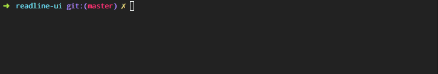

## Usage

```js
var UI = require('');
var ui = new UI();
```

## Example



The following example shows how to create a basic input prompt. This is a greatly simplified version of [prompt-base][]. 

_(This code is also in [example.js](example.js) if you want to run it yourself.)_

```js
var cyan = require('ansi-cyan');
var UI = require('');
var ui = new UI();

// first, we need to render the "question" 
// to display in the terminal
var prompt = '? foo ';
ui.render(prompt);

// on keypress events, re-render the prompt 
// along with user input
ui.on('keypress', function() {
  ui.render(prompt + ui.rl.line);
});

// when the "line" event is emitted (from the "enter" keypress)
// we `.end()` to unmute the output stream then pause the readline. 
ui.on('line', function(answer) {
  ui.render(prompt + cyan(answer));
  ui.end();
  ui.rl.pause();
  console.log({color: answer});
});
```


## API


## Attribution

Inspired by the "screen manager" code in Inquirer.
