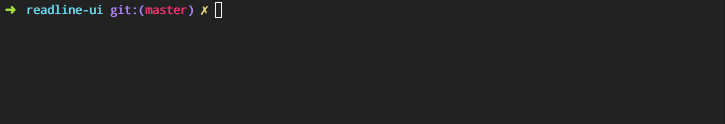

# readline-ui [](https://www.npmjs.com/package/readline-ui) [](https://npmjs.org/package/readline-ui) [](https://npmjs.org/package/readline-ui) [](https://travis-ci.org/enquirer/readline-ui)

> Create readline interface to use in prompts.

## Install

Install with [npm](https://www.npmjs.com/):

```sh
$ npm install --save readline-ui
```

## Usage

```js
var UI = require('readline-ui');
var ui = new UI();
```

## Example



The following example shows how to create a basic input prompt. This is a greatly simplified version of [prompt-base](https://github.com/enquirer/prompt-base).

_(This code is also in [example.js](example.js) if you want to run it yourself.)_

```js
var cyan = require('ansi-cyan');
var UI = require('readline-ui');
var ui = new UI();

// first, we need to render the "question" 
// to display in the terminal
var prompt = '? foo ';
ui.render(prompt);

// on keypress events, re-render the prompt 
// along with user input
ui.on('keypress', function() {
  ui.render(prompt + ui.rl.line);
});

// when the "line" event is emitted (from the "enter" keypress)
// we `.end()` to unmute the output stream then pause the readline. 
ui.on('line', function(answer) {
  ui.render(prompt + cyan(answer));
  ui.end();
  ui.rl.pause();
  console.log({color: answer});
});
```

## API

### [.onKeypress](index.js#L70)

Handle `keypress` events.

**Params**

* `str` **{String}**
* `key` **{Object}**
* `returns` **{undefined}**

### [.render](index.js#L82)

Render the prompt with the given `input` and optional `footer`.

**Params**

* `input` **{String}**
* `footer` **{String}**: (optional)
* `returns` **{undefined}**

### [.clearLines](index.js#L148)

Remove `n` lines from the bottom of the terminal

**Params**

* `lines` **{Number}**: Number of lines to remove

### [.cacheCursorPos](index.js#L159)

Cache the current cursor's column and line position.

* `returns` **{Object}**: UI instance.

### [.restoreCursorPos](index.js#L170)

Restore the cursor position to the cached column and line.

* `returns` **{Object}**: UI instance.

### [.pause](index.js#L180)

Pause the input stream, allowing it to be resumed later if necessary.

### [.close](index.js#L192)

Close the `readline.Interface` instance and relinquish
control over the input and output streams. Also removes
event listeners, and restores/unmutes prompt functionality.

### [.forceClose](index.js#L202)

Close the interface when the keypress is `^C`

### [.finish](index.js#L213)

Returns an "indentity" function that calls `.close()`,
which can be used as the final `.then()` function with
promises.

### [.end](index.js#L228)

Default method for writing a prompt to the terminal.
This can be overridden.

### [.log](index.js#L243)

Unmute then write to the output stream that was used
to create the readline interface, then re-mute the stream.
Useful for debugging prompts.

## Attribution

Inspired by the "screen manager" code in Inquirer.

## About

### Related projects

* [enquirer](https://www.npmjs.com/package/enquirer): Intuitive, plugin-based prompt system for node.js. Much faster and lighter alternative to Inquirer, with all… [more](https://github.com/enquirer/enquirer) | [homepage](https://github.com/enquirer/enquirer "Intuitive, plugin-based prompt system for node.js. Much faster and lighter alternative to Inquirer, with all the same prompt types and more, but without the bloat.")
* [prompt-choices](https://www.npmjs.com/package/prompt-choices): Create an array of multiple choice objects for use in prompts. | [homepage](https://github.com/enquirer/prompt-choices "Create an array of multiple choice objects for use in prompts.")
* [prompt-question](https://www.npmjs.com/package/prompt-question): Question object, used by Enquirer and prompt plugins. | [homepage](https://github.com/enquirer/prompt-question "Question object, used by Enquirer and prompt plugins.")
* [readline-utils](https://www.npmjs.com/package/readline-utils): Readline utils, for moving the cursor, clearing lines, creating a readline interface, and more. | [homepage](https://github.com/enquirer/readline-utils "Readline utils, for moving the cursor, clearing lines, creating a readline interface, and more.")

### Contributing

Pull requests and stars are always welcome. For bugs and feature requests, [please create an issue](../../issues/new).

Please read the [contributing guide](.github/contributing.md) for advice on opening issues, pull requests, and coding standards.

### Building docs

_(This project's readme.md is generated by [verb](https://github.com/verbose/verb-generate-readme), please don't edit the readme directly. Any changes to the readme must be made in the [.verb.md](.verb.md) readme template.)_

To generate the readme, run the following command:

```sh
$ npm install -g verbose/verb#dev verb-generate-readme && verb
```

### Running tests

Running and reviewing unit tests is a great way to get familiarized with a library and its API. You can install dependencies and run tests with the following command:

```sh
$ npm install && npm test
```

### Author

**Jon Schlinkert**

* [github/jonschlinkert](https://github.com/jonschlinkert)
* [twitter/jonschlinkert](https://twitter.com/jonschlinkert)

### License

Copyright © 2017, [Jon Schlinkert](https://github.com/jonschlinkert).
Released under the [MIT License](LICENSE).

***

_This file was generated by [verb-generate-readme](https://github.com/verbose/verb-generate-readme), v0.6.0, on May 21, 2017._